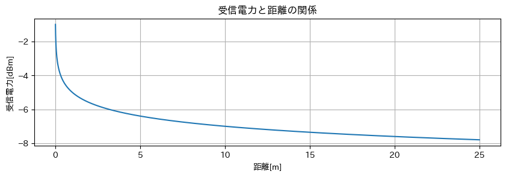
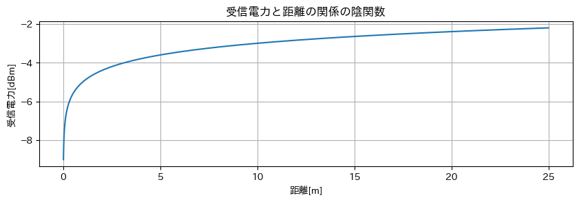

# RSSI の 作り方

y = (TxPower - 10) * n * log(10,x)

TxPower が電波の強さを表す値
デフォルトは 0

n は電波の信用性を見れる
デフォルトは n = 0.2
悪い場合は n = 0.4

# RSSI の値に近似するようにバイアスをかける

y = (TxPower - 10) * n * log(10,x) + baius

baius = -5

## 陰関数をとる

陰関数を確率密度関数として、RSSIの値をもとに確率密度を計算する
計算した確率密度を重みとして計算する

RSSIを強い値を算出した場合には強く出すために重みをつけてみた場合を検証する

